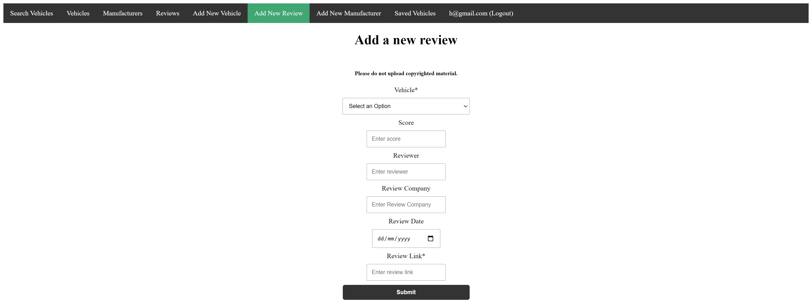

# COM519 Advanced Database Systems - Report

## How can the method of researching and evaluating potential vehicle purchases be improved?

### Solution hosted at: https://serene-tor-99412.herokuapp.com/
### Solution repository hosted at: https://github.com/kvpeacock/COM519-AE1-main

***

## Introduction

Currently there are no websites that provide a user with a vehicle catalog, and allow them to save and compare different vehicles and their specifications. Sites designed for selling vehicles, such as Auto Trader and eBay, only list vehicles for sale, and users can only save a specific advert to their favorites - not the vehicle itself. Parkers is a great website, and allows users to search through an extensive vehicle catalog, providing expert reviews, vehicle specifications, and the ability to save a specific vehicle to their favorites. However, comparing between 2 vehicles is clunky, as you cannot view 2 different vehicles at the same time, without opening a new tab. With these considerations in mind, my solution aims to allow users to view vehicle specifications and reviews in a similar way to Parkers, but also easily be able to save as many vehicles as they wish to their favorites, which allow for easy comparisons as vehicle specifications will be displayed within the favorites page. 

Users will be able to upload review links for any vehicle listed within the database, allowing users to share their own reviews, or reviews from professionals. This should help users inform themselves about any particular vehicle they are considering, without the need to leave the webpage to search for reviews themselves. Users are able to add new manufacturers and vehicles to the database, and also have editing/deleting permission as default. This is with the aim of reducing the reliance on a site maintainer to consistently update the database whenever a new vehicle/review/manufacturer is created/released. Users can also search for a specific model, and add it to their favorites.

The ability to view reviews, look up a variety of manufacturers, and search/compare vehicles within a single website, makes my solution truly unique. The fact that users are entrusted with CRUD capabilities is also a distinctive part of this solution, the sole website within this category to do so.

<b> Requirements </b>

The solution must:

* Allow users to create, read, update, and delete vehicle entries in a vehicle collection.
* Allow users to create, read, update, and delete manufacturer entries in a manufacturer collection.
* Allow users to create, read, update, and delete vehicle review entries in a review collection.
* Allow users to register and login to the website.
* Allow users to seach for specific vehicles.
* Allow signed-in users to seach for specific vehicles, and save them to their favourites.
* Allow signed-in users to view their favourites.
* Be deployed using a serverless infrastructure.

## System Overview

### Datastores

#### Models and Databases

Within my application, there are 4 main collections:

* Manufacturer  
    * This collection is used to store manufacturers, and their related properties (such as date founded, country of origin etc.)

* Review
    * This collection is used to store reviews, and their related properties  (such as review score, review link etc.)

* Specification  
    * This collection is used to store vehicle specifications, and their related properties (such as brake horsepower, manufacturer etc.)

* User  
    * This collection is used to store users, and their related properties (such as email, favorited vehicles etc.)

#### File System

The seed file for the database is a JSON file titled Vehicles.JSON. It contains ten entities, used to populate the database with initial values. Each entity contains the properties needed to create populate the manufacturer, review, and specification collections. The database is hosted on Atlas DB and the webpage is hosted on Heroku, creating a serverless infrastructure.

### Views

There are a number of views used within this application, all of which have a specific purpose and use cases.

#### Standard Views

* Search Specifications:  
    * This view is used for searching functionality. The user can enter a partial vehicle manufacturer to search for, and a list of matches will be displayed. Each entry also has two buttons, used to redirect the user to the edit page for the particular vehicle, or to delete the vehicle from the catalog. Provided that the user is signed in, an additional button will be present, allowing the user to save a particular vehicle to their favorites
    
    
    Searching for 'lex', whilst signed out. No save button is present.

    
    Searching for 'lex', whilst signed in. A save button is present.

* Specifications:  
    * This view is used to display a list of vehicles specifications from the specification collection to the user. Each entry also has 2 buttons, used to redirect the user to the edit page for the particular vehicle, or to delete the vehicle from the catalog.
    
    
    The specification view.

* Manufacturers:  
    * This view is used to display a list of manufacturers from the manufacturer collection to the user. Each entry also 2 buttons, used to redirect the user to the edit page for the particular manufacturer, or to delete the vehicle from the catalog.

        
        The manufacturer view.

* Reviews:  
    * This view is used to display a list of reviews from the review collection to the user. Each entry also 2 buttons, used to redirect the user to the edit page for the particular review, or to delete the vehicle from the catalog.

        
        The review view.

* Home:  
    * This view is used solely to redirect the user to the specification view. 

#### Views Used For Adding New Entity

* Create Specification:  
    * This view is used to allow the user to define a new vehicle to add to the specification collection. The manufacturer and model are required. Only vehicles produced by a manufacturer in the manufacturer collection can be added.

        
        Partial screenshot of the Create Specification view.

* Create Review:  
    * This view is used to allow the user to define a new review to add to the review collection. The vehicle and review link are required. Only vehicles in the specifications collection can be reviewed.

        
        Create Review view.

* Create Manufacturer:  
    * This view is used to allow the user to define a new manufacturer to add to the manufacturer collection. The manufacturer name is required. The user must be signed in to access this page.

        
        Create Manufacturer view.

#### Views Used For Updating An Entity

*  Update Specification:  
    * This view is used to allow the user to update a particular vehicle specification.

        
        Update Specification view, for the Audi S5.

*  Update Manufacturer:  
    * This view is used to allow the user to update a particular manufacturer.

        
        Update Manufacturer view, for Jaguar.

*  Update Review:  
    * This view is used to allow the user to update a particular review.

        
        Update Review view, for a Audi S5 review.

#### User-related Views

* Saved Specifications:  
    * This view is used to allow the user to view their saved vehicles. Each entry has a delete button, allowing he user to remove a vehicle from their saved list.

        
        Saved Specifications view.

* Login:  
    * This view is used to allow the user to login to the website. If there is no matching user, an error message will be displayed.

        
        Login view.

* Create User:  
    * This view is used to allow the user to sign up to the website. If an account with the submitted email exists already, a message alerting the user of this will be displayed.

        
        Create User view.

### System Diagram

##### Simple Component Diagram

Here is a simple component diagram, showcasing the connections between the web server, database server, and the client.

## Key Design Decisions

### Database Design

Here is an Entity Relationship Diagram, demonstrating the database entities, and their relationships:

#### Each entity in the Specification collection has many properties:

* Many important vehicle details are stored, such as MPG, average used price, insurance group, and performance related data. Since the solution's aim is to help inform prospective buyers, great consideration was necessary to work out what properties were necessary to the average consumer, and what properties are far too niche for an average consumer to be concerned about, such as tyre radius, spring rate etc.

* manufacturer_id:  
    * This property stores a ObjectID referencing the manufacturer, stored within the Manufacturer collection, that produced this vehicle.

#### Each entity in the Manufacturer collection has 6 properties:

* _id:  
    * This is an auto-generated property that acts as a primary key.

* name:  
    * This property stores the name of the manufacturer.

* country:  
    * This property stores the country of the manufacturer.

* founding_year:  
    * This property stores the founding year of the manufacturer.

* hq:  
    * This property stores the name of the city/location of the manufacturer's headquarters.

* type:  
    * This property stores the type of the manufacturer, such as Public, Private, Department etc.

#### Each entity in the User collection has 4 properties:

* _id:  
    * This is an auto-generated property that acts as a primary key.

* email:  
    * This property stores the user's email address. It has a unique constraint, so multiple accounts for a single email address cannot be created.

* password:  
    * This property stores a hash of the user's password. Plain text passwords are not stored.

* saved_specifications:  
    * This property stores a list of ObjectIDs referencing specifications (in the Specification collection) that the user has chosen to save. This list can be viewed within the 'Saved Vehicles' webpage.

#### Each entity in the Review collection has 3 properties:

* _id:  
    * This is an auto-generated property that acts as a primary key.

* vehicle_id:  
    * This property stores a ObjectID referencing the vehicle that has been reviewed from the Specification collection.

* review_contents:  
    * This is an embedded object used to store key review details, such as review author, review score, and a link to read the review. No reviews are stored in the database, to save storage and to ensure no copyright policies are infringed.

### Security and Scalability

The solution uses user authentication, and user passwords are never stored in plain text. Passwords are hashed using the bcrypt library, which is based upon the Blowfish cipher. The hashed passwords are stored within the User collection, which is apart of the main Vehicle database. To improve security, the User collection could be edited, removing the saved_specifications property. A new collection could be created, containing just 2 properties - user_id, and saved_specifications. This separates sensitive account data from the non-sensitive data. The User collection could then be stored in another database, meaning if the main database is compromised, account details will not be discovered.

Object references are used throughout the solution, ensuring no repeated data is present. This greatly improves scalability, as storage costs are significantly reduced. 
Since the solution utilises a serverless deployment, expanding data storage or increasing website bandwidth is incredibly simple, as all you need to do is upgrade your server plan. 

## Conclusion

The aim of this solution was to solve the question 'How can the method of researching and evaluating potential vehicle purchases be improved?'. The solution provides users with the means to research and compare specific vehicles, look up reviews, and learn the basic details of vehicle manufacturers.It has met all the requirments, and therefore the application provides a strong solution to the original question. Advanced MongoDB strategies have been used, such as embedded objects, pushing/pulling, and creating aggregates. The UI is clean and unobstructive, and the serverless infrastructure allows for incredible scalability. 

There are, however, a few things I think could be improved or added, to increase the attractiveness of the solution:

* A fully optimised UI for mobile/tablet users. 
* Pagination is missing from the solution. Once the collections increase in size, it would be incredibly inefficient to load every single entity on a single page.
* The way in which to add select a vehicle to review must edited once the vehicle collection increases in size. A dropdown to filter by manufacturer, and then filter by model would be a significant improvement to the user experience.
* Since users have CRUD capabilities, a database backup should be enforced at specific intervals (e.g., once a day) to ensure data is saved incase the database is attacked (e.g., a user deleting all vehicles).
As a direct result of this module, I have become familiar with MongoDB and the key process involved when designing and implementing a database and associated web application. Many of these key processes can be used elsewhere on other software projects, and I plan to enhance my methodology at work using them. 

